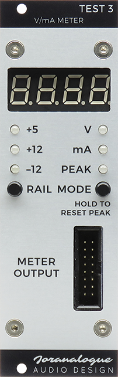
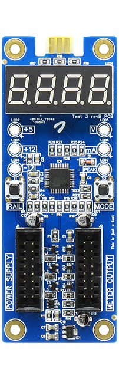
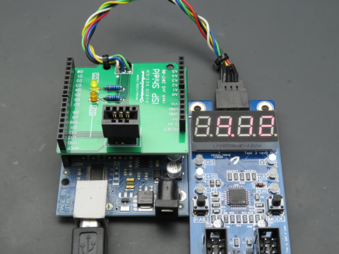

# Test&nbsp;3 Eurorack V/mA Meter
**Joran van Gremberghe / [Joranalogue Audio Design](https://joranalogue.com/)**

Released to the synth DIY community under [CC BY-SA](https://creativecommons.org/licenses/by-sa/4.0/) and the [GPL](https://www.gnu.org/licenses/gpl-3.0.en.html).

 

Test&nbsp;3 is a voltage and current meter for Eurorack modular synthesisers, available as a DIY kit with optional front panel. The hardware includes a [Microchip/Atmel AVR ATmega328P-A microcontroller](http://www.microchip.com/wwwproducts/en/ATmega328p), programmed using the [Arduino](https://arduino.cc/) IDE with a custom board definition.

The **build instructions** and **user manual** are found on the product page at https://joranalogue.com/test-3/

## Version history
### Hardware
* revB | 2017-02-17 | initial release

### Firmware
* v1.0 | 2017-08-17 | initial release

## Repository contents
* `images`: pictures used in this README document.
* `firmware`: Arduino firmware.
* `hardware`: bill of materials (PDF/Excel XLSX) and schematic files (PDF/DipTrace DCH).

## Theory of operation
### Arduino board definition
The firmware for the AVR microcontroller is programmed using the Arduino IDE with a custom '[board definition](https://github.com/joranvg/arduino-atmega328p-a)', specifically for the 328P-A variant (TQFP-32 package). It provides additional I/O capabilities over the standard Arduino Uno:
* Internal oscillator used at 8&nbsp;MHz, instead of external 16&nbsp;MHz crystal. Although the internal oscillator is less accurate, this is not a timing-critical application. The external oscillator pins can now be used as digital I/O pins 14 and 15. In Test&nbsp;3, pin 14 is an LED multiplexing line.
* The TQFP package includes two additional ADC pins (ADC6 and ADC7), compared to the DIP variant. These pins can now be addressed as analogue pins 6 and 7. They can not be used as digital I/O. These extra ADC pins are left unused in Test&nbsp;3.

### Display and LEDs
The multiplexed LED display and discrete LEDs are driven directly from the ATmega32P. The [SevenSeg](https://github.com/sigvaldm/SevenSeg) library by Sigvald Marholm is used to simplify the code. The discrete LEDs form digit 0, while the display forms digits 1-4. This means that all LEDs are driven as if they are part of a 5-digit display.

### Measurements
The power rail currents are passed through 50 mΩ shunt resistors. [Texas Instruments INA199](http://www.ti.com/product/INA199) current shunt amplifiers are used to amplify the small shunt resistor voltages to a suitable measurement level, up to +5&nbsp;V at 1&nbsp;A of current.

For the voltage measurements of the +5 and +12 rails, simple voltage dividers are sufficient. An inverting amplifier is used for the &minus;12 rail voltage.

To digitise the analogue measurement values, the ATmega328P's internal 10-bit analogue-to-digital-converters (ADCs) are used: 6 channels for 6 measurements (V and mA on each of the 3 rails).

Test&nbsp;3 simultaneously performs all measurements 1000 times per second, or 1&nbsp;kHz. This is achieved with a Timer1 interrupt routine, set up using the [TimerOne](https://github.com/PaulStoffregen/TimerOne) library by Paul Stoffregen. The samples are grouped by 10, and the average of each group is calculated. These results, known as the 'bottom averages', are used for updating the current peak values: if the average value of the latest 10 samples is greater than the stored peak value for a given rail, this becomes the new peak value for that rail. This happens continually in the background, regardless of the selected rail and mode.

10 of these average values, representing 100 samples, are averaged again for the V and mA values displayed in real-time. These are the 'top averages'. Although only the top averages are used for the voltage measurements, the same top/bottom system is used for both voltage and current to simplify the code.

Thus, the mA peak updates at 100&nbsp;Hz, and the real-time V and mA at 10&nbsp;Hz. The averaging helps to keep the readings stable and filters out unwanted spikes, while the 10x higher update rate on the mA peak still allows fast current fluctuations to be captured.

### EEPROM
Each time the rail or mode is changed, the EEPROM is updated. This way, if power to Test&nbsp;3 is cycled, it will boot up in the configuration it was last used in. The rail is stored in address 0, mode in 1. If no configuration is found, Test&nbsp;3 boots up in voltage measurement mode on the +12 rail.

Only the first 2 bytes of the 1024-byte memory are used. No EEPROM wear-leveling is included in the firmware, as this was not deemed necessary. A lifetime of 100,000 writes is quoted for the ATmega328P, which is the same as the mechanical life of the push switches.

## Programming
The microcontroller on the Test&nbsp;3 circuit board is pre-programmed. Programming is only required if you wish to update the firmware, or if you are developing your own.

### Connection
Test&nbsp;3 does not use the Arduino bootloader. Instead, programming is done via in-system programming (ISP aka ICSP). 6 card edge contacts labelled 'ISP' are present on the PCB. This allows flexibility in the programming connection:

* Use a card edge connector ([TE 7-5530843-7](http://www.te.com/global-en/product-7-5530843-7.html) or equivalent).
* Solder a 6-pin header to the contacts, and use a standard ISP cable.

The contacts are assigned according to the [AVR ISP pinout](https://www.microchip.com/webdoc/avrbutterfly/images/IspHeader.png). Pin 1 is marked with a small circle on the bottom side silkscreen.

 

To simplify programming, an Arduino ISP 'shield' has been designed which fits on top of the Arduino Uno. The Test&nbsp;3 circuit board can simply be plugged in, either directly or via a cable. [Contact me](https://joranalogue.com/pages/about) if you'd like to acquire one of these boards.

### Power
By default, Test&nbsp;3 is powered from the +12 rail of your Eurorack system. However, it can also be powered from ISP (Vcc = +5&nbsp;V). If both power sources are available, the +12 rail will be used and no damage will occur.

When powered from ISP, the +12 rail will measure 5&nbsp;V, minus one diode drop (about 4.3&nbsp;V). Because of the lower operating voltage, the LEDs will be dimmer; this is normal.

### Uploading
The recommended method of reprogramming Test&nbsp;3 is using an Arduino Uno or equivalent, configured as a programmer with the 'ArduinoISP' sketch.

Before you start, you'll need the custom Arduino board definition 'ATmega32P-A (8 MHz internal clock)' to program Test&nbsp;3. The instructions to install it can be found in [this repository](https://github.com/joranvg/arduino-atmega328p-a). Also make sure your Arduino IDE is up-to-date (version 1.8.5 at the time of writing).

Connect the Arduino to your computer using a USB cable and open the ArduinoISP sketch, found under File > Examples > ArduinoISP > ArduinoISP. Select the relevant board definition for your Arduino (typically 'Arduino/Genuino Uno') and serial port in the Tools menu. Make sure Test&nbsp;3 is not connected to the Arduino. Press the upload button, and the Arduino will be configured as a serial programmer. For more information, see [this tutorial](https://www.arduino.cc/en/Tutorial/ArduinoISP) on the Arduino website.

The next step is to connect Test&nbsp;3 to the Arduino, as outlined above under **Connection**. The Arduino will provide power to Test&nbsp;3 for programming, so a connection to your Eurorack power supply is not needed. Your Test&nbsp;3 should power up as soon as it is connected.

Open the firmware sketch to be programmed in the Arduino IDE. In the Tools menu, select the 'ATmega328P-A (8 MHz internal clock)' board definition and 'Arduino as ISP' programmer.

Now we're ready to upload the sketch. **Do not use the upload button in the Arduino IDE.** Instead, use 'Sketch > Upload Using Programmer'. This will compile and upload the sketch to Test&nbsp;3, using the Arduino as the programmer. Otherwise, the Arduino itself will be reprogrammed!

After the upload completes, Test&nbsp;3 will reset and boot up using the new software. The version number is shown during startup.

## License
The bill of materials (BoM) and schematic are released under [CC BY-SA](https://creativecommons.org/licenses/by-sa/4.0/); the firmware under the [GPL](https://www.gnu.org/licenses/gpl-3.0.en.html). This means that you can use Test&nbsp;3 as a basis for your own designs, or release your own alternative firmware. Commercial use is allowed, but you must attribute and release under the same license(s).

The PCB and front panel design files are not freely available. Do not use the 'Joranalogue Audio Design' name or logo in your derivative project.

*This is not an official Arduino project. It is released to the public community without any guarantees or warranties. The Arduino trademark is owned by Arduino AG. Joranalogue Audio Design is in no way affiliated with Arduino AG.*
